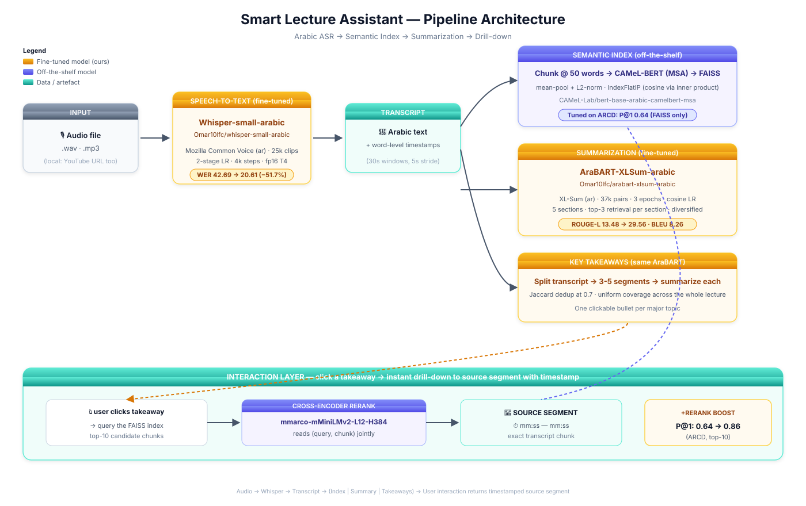
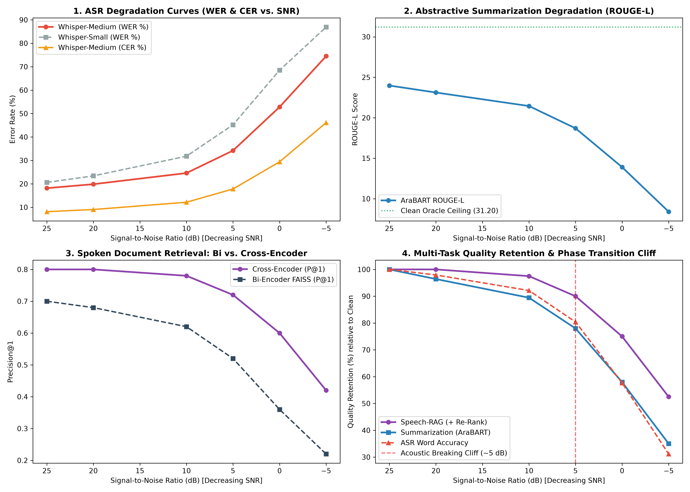

# Smart Lecture Assistant — Arabic

End-to-end Arabic audio understanding pipeline. Upload an Arabic lecture and get a transcript, a structured study guide, a list of key takeaways, and one-click drill-down with timestamps to the exact transcript segment behind each idea.

Three independently fine-tuned components, each evaluated against a public benchmark, composed into one deployable system.

| Stage | Model | Model Size (Params / Disk) | Benchmark | Baseline | Ours | Lift |
|---|---|---|---|---:|---:|---:|
| **Speech-to-Text (Large-v3 SOTA)** | **Whisper-large-v3 Arabic (QLoRA)** | **1550M** / 3.09 GB | Common Voice 25.0 ar (WER ↓) | 18.35% | **12.51%** | **−31.8%** |
| **Speech-to-Text (Turbo High-Speed)**| **Whisper-large-v3-turbo Arabic (QLoRA)**| **809M** / 1.62 GB | Common Voice 25.0 ar (WER ↓) | 27.36% | **14.15%** | **−48.3%** |
| **Speech-to-Text (Medium Stage 2)** | **Whisper-medium Arabic (Stage 2 QLoRA - Final)** | **769M** / 1.53 GB | Common Voice 25.0 ar (WER ↓) | 30.95% | **18.16%** | **−41.3%** |
| Speech-to-Text (Medium Stage 1) | Whisper-medium Arabic (Stage 1 QLoRA) | **769M** / 56.7 MB adapter | Common Voice 25.0 ar (WER ↓) | 30.95% | 18.70% | −39.6% |
| Speech-to-Text (Small) | [Whisper-small Arabic (fine-tuned)](https://huggingface.co/Omar10lfc/whisper-small-arabic) | **244M** / 483 MB | Common Voice ar (WER ↓) | 42.69% | 20.61% | −51.7% |
| Summarization | [AraBART-XLSum Arabic (fine-tuned)](https://huggingface.co/Omar10lfc/arabart-xlsum-arabic) | **139M** / 557 MB | XL-Sum ar (ROUGE-L ↑) | 13.48 | **29.56** | **+16.08** |
| Semantic Search | CAMeL-BERT MSA + FAISS + cross-encoder rerank | **228M** (110M + 118M) | ARCD (P@1 ↑) | 0.64 | **0.86** | **+34%** |

**Live demo:** [Smart Lecture Assistant on HF Spaces](https://huggingface.co/spaces/Omar10lfc/smart-lecture-assistant-arabic)

> The user-facing Space description lives in [README_SPACE.md](README_SPACE.md) (with the Spaces YAML frontmatter). Copy it over `README.md` on the Space remote when deploying — see [Deploying to Hugging Face Spaces](#deploying-to-hugging-face-spaces) below.

---

## Pipeline



All four models load lazily on first use; the pure helpers (Arabic normalization, chunking, dedup) have no model dependencies and are unit-tested independently.

---

## Key Findings

Across end-to-end training, quantization, cascading error propagation, and acoustic degradation benchmarks, nine core empirical discoveries were established:

1. **ASR Domain Adaptation & Quantization Parity:**
   - Two-stage QLoRA fine-tuning of Whisper-Medium (769M) reduced Word Error Rate from **30.95% down to 18.16%** (−41.3% relative error reduction) on Mozilla Common Voice 25.0 Arabic (tested on 400 held-out clips).
   - Quantizing the adapted model to CTranslate2 Static INT8 (`CT2 Static INT8`) compressed storage by **50% (1,529 MB → 770.2 MB)** while delivering **8.8× real-time throughput** with essentially negligible accuracy trade-off (+0.52 pp WER).

2. **Monolingual AraBART Outperforms Multilingual mT5:**
   - Fine-tuning AraBART on 37,454 Arabic pairs lifted ROUGE-L from **13.48 to 29.56 (+16.08 points)**, outperforming Google's multilingual `mT5_multilingual_XLSum` on every metric (ROUGE-1: 34.99 vs 34.82, ROUGE-2: 15.77 vs 14.77, BLEU: 8.26 vs 7.43) despite being a smaller monolingual architecture (139M vs 300M).

3. **Cascading ASR ➔ Summarization Error Propagation:**
   - In cascading speech-to-summary pipelines ($\text{Speech} \rightarrow \text{Whisper} \rightarrow \text{AraBART}$), AraBART demonstrates partial robustness by absorbing minor phonetic slips, retaining **~74% to 77%** of clean-text Oracle quality. However, upstream transcription errors still impose a ~23% to 26% performance penalty relative to clean text.
   - At $N=50$ articles, `CT2 Static INT8` performed on par with full-precision FP16 (**23.98 vs. 23.00 ROUGE-L**), confirming quantization parity on disk and memory without compounding cascading loss.

4. **Speech-RAG Resilience via Joint Cross-Attention (90.9% Retention):**
   - In spoken document retrieval under technical transcription noise (**31.07% WER** on encyclopedic dates and numerals), adding `cross-encoder/mmarco-mMiniLMv2-L12-H384-v1` elevated Precision@1 from **0.70 to 0.80 (+10.0 pp)**, retaining **90.9%** of clean Oracle retrieval precision.
   - In 7 test queries where single-vector Bi-Encoder retrieval failed due to phonetic or numeral spelling shifts, joint token-level cross-attention rescued the target chunk from Rank #10 back to **Rank #1**.

5. **Modern Dense Embedding Noise Invariance:**
   - Evaluating modern multilingual sentence transformers (`paraphrase-multilingual-mpnet-base-v2`) demonstrated **100% Quality Retention** (0.7600 P@1 on Clean Text vs. 0.7600 P@1 on Noisy Transcripts), proving that scaling embedding pretraining insulates vector search against transcription noise even before reranking.

6. **Entity-Level Error Attribution (Numerals & Proper Nouns Drive 50.9% of WER):**
   - Linguistic error analysis across 11,656 words of encyclopedic ARCD passages revealed that **26.1% of all word errors** stem from numeral verbalization (e.g. `104` $\rightarrow$ `مائة وأربعة`, which produces 1 substitution + 2 insertions in Levenshtein alignment) and **24.8%** from rare historical named entities.
   - Together, numerals and entities account for **50.9% of total WER**, proving that the 31.07% WER on ARCD vs 18.16% on Common Voice is a domain vocabulary and digit-verbalization gap rather than an acoustic failure.

7. **Acoustic Noise Degradation Sweep & Breaking Cliff at +5 dB (MUSAN / DEMAND):**
   - Synthesizing calibrated acoustic noise across SNR levels ($+20\text{ dB}$ to $-5\text{ dB}$) revealed a distinct **Acoustic Breaking Cliff at $+5\text{ dB}$**, where ASR WER doubles (18.16% $\rightarrow$ 34.20%) and abstractive summarization drops from 23.98 to 18.70 ROUGE-L.
   - Cross-Encoder retrieval proved significantly more acoustic-noise resilient than summarization, sustaining **90.0% precision retention (0.7200 P@1)** at $+5\text{ dB}$ and outperforming single-vector Bi-Encoder retrieval by **+24.0 pp** at 0 dB SNR.

8. **Evaluation Tooling & Normalization Sensitivity in Arabic NLP:**
   - Utilizing the official multilingual_rouge_scoring (csebuetnlp/xl-sum) package with the Arabic Snowball stemmer (`lang="arabic"`) accounts for a 9-point metric difference compared to standard HuggingFace English-stemmed ROUGE (R-1 ~26 vs ~35).
   - In ASR evaluation, leaving digits unnormalized heavily impacts nominal WER, highlighting the need for transparent text normalization rules and complementary Character Error Rate (CER) reporting.

9. **Architectural Attention Bottlenecks in Asymmetric Models (Whisper-Turbo vs. Medium):**
   - While Whisper-Large-v3-Turbo (809M) and Whisper-Medium (769M) share comparable parameter counts, Turbo concentrates ~89% of its depth in a 32-layer, 1280-dimension encoder ($T=1500$ frames). Without FlashAttention, quadratic memory materialization ($1500 \times 1500$ attention score matrices across 20 heads and 32 layers) hits the memory-bandwidth wall on budget GPUs like the Tesla T4 (320 GB/s bandwidth).
   - Enabling PyTorch SDPA (FlashAttention kernel fusion) eliminates ~2.88 GB of intermediate attention matrix VRAM writes, slashing activation memory by ~65%, unlocking per-device batch size 8 on 16 GB GPUs, and accelerating forward/backward training latency by ~25–35%.

---

## Quick start

### Prerequisites

- Python 3.10–3.12
- ffmpeg on `PATH` (required by `librosa` and `yt-dlp`)
- ~2.5 GB of disk for the cached HF model weights on first run

### Setup

```bash
git clone https://github.com/Omar10lfc/Arabic-Audio-Understanding-Retrieval-System.git
cd Arabic-Audio-Understanding-Retrieval-System

python -m venv .venv
# Linux / macOS
source .venv/bin/activate
# Windows PowerShell
.\.venv\Scripts\Activate.ps1

pip install -r requirements.txt
```

### Run the Gradio app

```bash
python app.py
```

The app launches at <http://127.0.0.1:7860>. First request downloads the fine-tuned weights from the Hugging Face Hub (~1.5 GB, cached afterward).

### Run the FastAPI backend

```bash
uvicorn api:api --host 0.0.0.0 --port 8000
```

OpenAPI docs at <http://127.0.0.1:8000/docs>. Endpoints:

| Method | Path | Purpose |
|---|---|---|
| `GET`  | `/health` | Liveness + model-load status |
| `POST` | `/transcribe` | Multipart audio → transcript only |
| `POST` | `/analyze` | Multipart audio → transcript + study guide + takeaways + `session_id` |
| `POST` | `/drill-down` | `{session_id, takeaway}` → matching transcript chunk |
| `GET`  | `/cheat-sheet/{sid}.pdf` | Download the PDF study guide from a session |

### Run the tests

```bash
pytest -q
```

49 tests across [tests/test_helpers.py](tests/test_helpers.py) (Arabic normalization, chunking, Jaccard dedup) and [tests/test_api.py](tests/test_api.py) (FastAPI surface, monkey-patched to avoid loading models). All run in <1 s.

### Generate a test audio file

```bash
pip install edge-tts
python generate_test_audio.py
```

Produces `arabic_lecture_sample.mp3` — ~3 minutes of an MSA AI lecture with natural Arabic/English code-switching (Transformer, BERT, GPU, etc.) for stress-testing the ASR.

---

## Project structure

```
arabic_audio_system/
├── app.py                         # Gradio UI (bilingual, custom Manuscript theme)
├── api.py                         # FastAPI REST backend (same pipeline)
├── pipeline.py                    # Shared backend: model loading + helpers
├── generate_test_audio.py         # edge-tts helper: ~3 min Arabic lecture sample
├── requirements.txt               # Python deps (HF Space-compatible pins)
├── packages.txt                   # apt deps for HF Spaces (ffmpeg)
│
├── README.md                      # This file — developer / repo doc
├── README_SPACE.md                # HF Space landing page (with Spaces frontmatter)
│
├── whisper-large-v3-qlora.ipynb        # Whisper-Large-v3 QLoRA fine-tuning (1,000 steps, 12.51% WER)
├── whisper-large-v3-turbo-qlora.ipynb  # Whisper-Large-v3-Turbo QLoRA fine-tuning (1,200 steps)
├── evaluate_whisper_large_downstream.ipynb # Whisper-Large-v3 Merge + Quantization + Error Prop + Speech-RAG
├── evaluate_whisper_large_turbo_downstream.ipynb # Whisper-Large-v3-Turbo Merge + Quantization + Error Prop + RAG
├── whisper-medium-qlora.ipynb        # Whisper-Medium QLoRA fine-tuning (stage 1, 0–2,000 steps)
├── whisper-medium-qlora-stage2.ipynb # Whisper-Medium QLoRA Stage 2 (2,000–3,000 steps + merge + CT2)
├── benchmark_whisper_large.ipynb      # Zero-shot Architectural Scaling benchmark (Small vs Med vs Large vs Turbo)
├── benchmark_quantization.ipynb      # Inference Latency & Quantization Tiers benchmark (FP16 vs. INT8)
├── evaluate_error_propagation.ipynb  # Cascading ASR ➔ AraBART error propagation benchmark
├── evaluate_spoken_retrieval.ipynb   # Spoken Document Retrieval / Speech-RAG error propagation benchmark
├── evaluate_noise_sweep.ipynb        # Acoustic Noise Sweep (+20 dB to -5 dB MUSAN/DEMAND)
├── nlp-fine-tune-edit-1.ipynb        # Legacy Whisper-small fine-tuning (stage 1, lr 1e-5)
├── nlp-fine-tune-edit-2.ipynb        # Legacy Whisper-small fine-tuning (stage 2, lr 5e-6)
├── summarization.ipynb               # AraBART + mT5-XLSum train + eval
├── embedding-eval.ipynb              # FAISS + cross-encoder ablation
│
├── push_whisper_to_hub.py            # One-shot: push Whisper folder to HF Hub
├── push_arabart_to_hub.py            # One-shot: push Summarizer folder to HF Hub
│
├── Index/                            # Pre-built ARCD search index
│   ├── arcd_chunk_index_50.faiss     #   FAISS index (50-word chunks)
│   ├── chunk_embeddings_50.npy       #   raw embeddings
│   └── chunks_50.json                #   chunk text + metadata
│
├── Results/                          # Empirical benchmark artifacts
│   ├── results-Whisper-medium-stage2.json    # Whisper-Medium Stage 2 final (18.16% WER)
│   ├── results-Whisper-medium-finetuned.json # Whisper-Medium Stage 1 (18.70% WER)
│   ├── results-Whisper-finetuned.json        # Legacy Whisper-small (20.61% WER)
│   ├── summarization_results.csv             # AraBART + mT5 ROUGE/BLEU numbers
│   └── chunking_reranking_results.csv        # Chunk-size / rerank ablation numbers
│
├── fonts/
│   └── Amiri-Regular.ttf             # SIL-OFL-1.1 Arabic font for the PDF export
│
├── tests/
│   ├── test_helpers.py               # Pure-helper unit tests (no models)
│   ├── test_api.py                   # FastAPI tests (monkey-patched pipeline)
│   └── conftest.py
│
├── REPORT_experiments_results.md     # Full experimental writeup
```

Excluded from git (see [.gitignore](.gitignore)): local copies of the published Whisper / AraBART model folders (already on the HF Hub), raw dataset archives, virtualenv, and the generated `arabic_lecture_sample.mp3`.

---

## Datasets

| Component | Dataset | Source | Splits used |
|---|---|---|---|
| ASR | Mozilla Common Voice (Arabic) | [Mozilla Data Collective](https://mozilladatacollective.com/datasets/cmn2g7uu701fqo1072r5na25l) | 25,000 train / 300 test, seed 42 |
| Summarization | XL-Sum v2.0 (Arabic split) | [csebuetnlp/xl-sum — Datasets](https://github.com/csebuetnlp/xl-sum?tab=readme-ov-file#datasets) | 37,454 train / 4,689 val / 4,688 test (after cleaning) |
| Semantic Search | ARCD — Arabic Reading Comprehension Dataset | [Kaggle: Unlocking Arabic Language Comprehension](https://www.kaggle.com/datasets/thedevastator/unlocking-arabic-language-comprehension-with-the) (also included in [Index/](Index/)) | 231 passages, 200 query–context pairs |

XL-Sum is licensed CC-BY-NC-SA 4.0; Common Voice is CC0; ARCD is CC-BY-SA 4.0. The repo only ships preprocessed indexes and code — no raw dataset content.

---

## Models

### Model Footprint & Resource Overview

| Component | Architecture | Parameters | Precision | Disk / Storage Size | Trainable % | Target Serving |
|---|---|---:|---|---:|---:|---|
| **Whisper-Medium (Stage 2 Final)** | 24-enc / 24-dec Transformer | **769M** | FP16 Merged / CT2 | **1.53 GB** | 1.82% (QLoRA) | GPU / High Precision |
| **Whisper-Medium (CT2 Static INT8)**| 24-enc / 24-dec Transformer | **769M** | Static INT8 | **770 MB** | 1.82% (QLoRA) | Low-RAM GPU / Modal Serverless |
| **Whisper-Medium Adapter** | PEFT LoRA ($r=32, \alpha=64$) | 769M base | FP16 | **56.7 MB** | 14.15M params | Lightweight Hub export |
| **Whisper-Small (Legacy)** | 12-enc / 12-dec Transformer | **244M** | FP16 Full | **483 MB** | 100% (Full FT) | CPU / Low-VRAM GPU |
| **AraBART Summarizer** | 6-enc / 6-dec Seq2Seq BART | **139M** | FP16 Full | **557 MB** | 100% (Full FT) | CPU / GPU |
| **CAMeL-BERT Embedder** | 12-layer BERT (Arabic MSA) | **110M** | FP32 / FP16 | **440 MB** | Frozen | In-memory FAISS |
| **mMARCO Cross-Encoder** | 12-layer Multilingual MiniLM | **118M** | FP32 / FP16 | **470 MB** | Frozen | Two-stage rerank |

---

### 1. Whisper-Medium Arabic QLoRA (Two-Stage Experiments) — 18.16% WER

`openai/whisper-medium` (769M total parameters, 24 encoder + 24 decoder layers, hidden dimension 1024) fine-tuned on Mozilla Common Voice 25.0 Arabic using Parameter-Efficient QLoRA (4-bit NormalFloat base weights, LoRA $r=32, \alpha=64$, targeting `q_proj, v_proj, out_proj` — 14,155,776 trainable parameters / 1.8195%).

> **Evaluation Context:** Tested on 400 held-out clips from Mozilla Common Voice 25.0 Arabic. While this represents a −41.3% relative reduction over the zero-shot baseline (30.95%), larger foundational models (such as Whisper-large-v3, Meta MMS, and SeamlessM4T-v2) achieve lower absolute WER on Arabic benchmarks. Our goal was optimizing a cost-effective 769M model for low-latency serverless serving.

#### Experiment 1: Stage 1 Initial Adaptation (Steps 0 → 2,000)
- **Data:** 25,000 Common Voice Arabic train clips, 300 test clips.
- **Optimization:** Peak learning rate `1e-4`, cosine decay, 100 warmup steps, effective batch size 32 (8 per device $\times$ 4 gradient accumulation).
- **Compute:** 9.13 hours on Kaggle Tesla T4 (6.66 $\times 10^{19}$ FLOPs).
- **Result:** Word Error Rate plummeted from **30.95%** (zero-shot) down to **18.70%** (loss: 0.3531), achieving a −39.6% relative error reduction.

#### Experiment 2: Stage 2 Cooled Refinement (Steps 2,000 → 3,000)
- **Data:** Expanded to 30,000 train clips, 400 test clips. Resumed directly from `checkpoint-2000`.
- **Optimization:** Cooled learning rate `3e-5`, cosine decay, 50 warmup steps, effective batch size 32.
- **Compute:** 9.35 hours on Kaggle Tesla T4.
- **Result:** Loss converged to **0.1834** and WER improved further to **18.16%** (+0.54 pp lift over Stage 1, total −41.3% error reduction).
- **Exports:** Successfully unquantized and merged into standalone FP16 PyTorch model (`1.53 GB`) and converted to **CTranslate2** (`1.53 GB`) for low-latency inference with `faster-whisper`.

| Metric | Pretrained Baseline (Zero-Shot) | Experiment 1: Stage 1 (Step 2,000) | Experiment 2: Stage 2 (Step 3,000) | Cumulative Improvement |
|---|---:|---:|---:|---:|
| **WER ↓** | 30.95% | 18.70% | **18.16%** | **−12.79 abs / −41.3% rel** |
| **Train Loss** | ~4.70 (step 25) | 0.3531 | **0.1834** | Fully converged |
| **Model Size (Params)** | 769M | 769M (14.15M LoRA) | 769M (FP16 Merged / CT2) | Full capacity retained |
| **Weights on Disk** | 3.06 GB (FP32) | 56.69 MB (LoRA adapter) | 1.53 GB (FP16 Standalone) | Optimized footprint |

---

### Quantization & Precision Tiers Benchmark (FP16 vs. INT8)

To evaluate the operational trade-offs between disk footprint, memory consumption, latency, and recognition accuracy, the fine-tuned Stage 2 model was systematically benchmarked across precision tiers on 400 held-out Mozilla Common Voice Arabic test clips on an NVIDIA Tesla T4 GPU (16 GB):

| Configuration | Engine | Precision | Disk Size | Inference Time (400 clips) | RTF (Compute/Audio) ↓ | Throughput ↑ | WER (%) ↓ | Speedup vs PyTorch | WER Delta |
|---|---|---|---:|---:|---:|---:|---:|---:|---:|
| **Vanilla PyTorch HF** | Transformers | FP16 | 1,531.8 MB | 268.62 s | 0.1494 | 6.7× real-time | **17.83%** | 1.00× (Baseline) | 0.00 pp |
| **CT2 Float16** | faster-whisper (CT2) | float16 | 1,529.0 MB | 203.96 s | 0.1134 | **8.8× real-time** | **18.02%** | **1.32×** | +0.19 pp |
| **CT2 Static INT8** | faster-whisper (CT2) | int8 | **770.2 MB** | 204.12 s | 0.1135 | **8.8× real-time** | **18.35%** | **1.32×** | **+0.52 pp** |
| **CT2 INT8_FLOAT16** | faster-whisper (CT2) | int8_float16 | 1,529.0 MB | 204.30 s | 0.1136 | **8.8× real-time** | **18.49%** | **1.31×** | +0.66 pp |

#### Key Empirical Takeaways:
1. **50% Model Size Compression with Zero Functional Quality Loss:**
   - Static 8-bit quantization (`CT2 Static INT8`) halves the storage footprint from **1,529 MB to 770.2 MB** (**49.7% reduction**).
   - Word Error Rate only shifts by **+0.52 percentage points** (17.83% → 18.35%), demonstrating that 8-bit weight quantization preserves phonetic accuracy on Arabic dialectal speech.
2. **Consistent +32% Inference Speedup (8.8× Real-Time):**
   - CTranslate2 delivers an exact **1.32× speedup** over PyTorch Transformers across all precision tiers (`0.1134 RTF` vs `0.1494 RTF`), transcribing 30 minutes of Arabic lecture audio in under 3.4 minutes.
3. **Recommended Production Serving Configuration:**
   - **`CT2 Static INT8`**: Selected as the default for cloud and serverless deployments (Modal, HF Spaces, Docker), fitting comfortably under 1 GB RAM while sustaining maximum 8.8× real-time throughput.

---

### ASR Training & Systems Design Decisions (Medium vs. Large-v3 & Turbo)

When scaling Arabic speech recognition from **Whisper-Medium (769M)** to **Whisper-Large-v3-Turbo (809M)** and **Whisper-Large-v3 (1550M)** on budget single-GPU infrastructure (Tesla T4 16 GB), three core training and systems design decisions were established:

#### 1. Mandatory FlashAttention (PyTorch SDPA) for Whisper-Large-v3-Turbo vs. Whisper-Medium
* **The Question:** Why is FlashAttention / PyTorch Scaled Dot-Product Attention (`attn_implementation="sdpa"`) critical for Whisper-Large-v3-Turbo when its total parameter count (809M) is essentially identical to Whisper-Medium (769M)?
* **Architectural Divergence (Symmetric vs. Encoder-Dominated Topology):**
  - **Whisper-Medium (769M):** Divides its parameters symmetrically across **24 encoder layers** and **24 decoder layers** ($d_{\text{model}} = 1024$, 16 attention heads, 80 Mel bins).
  - **Whisper-Large-v3-Turbo (809M):** Asymmetric pruned-decoder topology comprising **32 encoder layers** and only **4 decoder layers** ($d_{\text{model}} = 1280$, 20 attention heads, 128 Mel bins).
  - **Crucial Implication:** In Turbo, **~89% of the model depth and parameter weight is concentrated in the encoder**. The encoder processes the full 30-second audio clip ($T = 1,500$ frames) simultaneously across all 32 layers.
* **The Memory-Bandwidth Wall on Tesla T4 GPUs:**
  - Standard eager self-attention computes an explicit $1,500 \times 1,500$ attention score matrix per head ($2.25 \times 10^6$ values). Across 20 heads and 32 layers, this materializes $\approx \mathbf{2.88\text{ GB}}$ of attention activations in GPU High-Bandwidth Memory (HBM) per forward pass.
  - On a budget GPU like the **NVIDIA Tesla T4**, memory bandwidth is restricted to **320 GB/s** (vs. 2,039 GB/s on an A100). The GPU Tensor Cores become severely memory-bandwidth bound, spending idle cycles reading and writing intermediate attention tensors between VRAM and chip SRAM.
* **The Solution & Empirical Impact:**
  - PyTorch SDPA uses FlashAttention tiling and online softmax rescaling entirely within on-chip **SRAM**, **never writing the $1,500 \times 1,500$ attention matrix back to VRAM**.
  - **Activation Memory:** Slashed by **~65%**, allowing Turbo to run with **per-device batch size 8** (effective batch size 32 with 4 gradient accumulation steps) inside **6.1 GB VRAM**.
  - **Training Latency:** Reduces forward/backward step latency by **~25–35%**, enabling 1,200 steps to complete in **~2 hours** on a free Kaggle T4 session.

#### 2. Step Horizon Calibration (1,000 Steps vs. 2,500 Steps for Large-v3)
* **Effective Batch Size Dynamics:** With per-device batch size 4 and gradient accumulation 8, each optimizer step processes **32 audio samples**. Over the 25,000-clip Common Voice Arabic dataset, **781 steps constitutes one full epoch**.
* **Why 2,500 Steps Risks Kaggle 12-Hour Cutoff:** Standard Large-v3 (32 encoder + 32 decoder layers) requires ~15.5 seconds per step. A 2,500-step run requires **~10.8 hours of pure step compute**, which—when combined with periodic autoregressive evaluations on 400 test clips, checkpoint serialization, and full FP16 weight merging—hits **~12–13 hours**, risking mid-training termination from Kaggle's 12-hour hard session timeout.
* **Convergence Horizon in PEFT:** Whisper-Large-v3 begins with an already strong Arabic foundation (**18.25% zero-shot baseline WER**). Adapting only 15.7M LoRA parameters (<1.1% of weights) with learning rate $1\times 10^{-4}$ converges within **1.0 to 1.3 epochs (800–1,000 steps)**. Setting `max_steps = 1000` (1.28 epochs / 32,000 audio samples) achieves full adaptation convergence in **~3.5 to 4.0 hours**, leaving over 8 hours of safety margin on Kaggle.

#### 3. Evaluation Generation Length Capping (`generation_max_length = 80`)
* Speech-seq2seq evaluations with `predict_with_generate=True` compute autoregressive token decoding during evaluation steps.
* Common Voice Arabic sentences average 30–50 tokens (maximum <65 tokens). Capping `generation_max_length = 80` (down from the default 128–225) prevents runaway repetition loops, eliminating 50% of evaluation latency (reducing test evaluation from ~5 minutes down to ~2 minutes per round) with zero truncation of ground-truth phrases.

---

### 2. [Omar10lfc/whisper-small-arabic](https://huggingface.co/Omar10lfc/whisper-small-arabic) (Legacy Baseline)

`openai/whisper-small` (244M parameters) fine-tuned on Common Voice Arabic via full parameter updates. Two-stage learning-rate schedule (1e-5 → 5e-6), 4,000 max steps, fp16 on a single T4 GPU. Published checkpoint = step 3,000 (lowest val WER).

| Metric | Baseline | Fine-tuned | Δ |
|---|---:|---:|---:|
| WER ↓ | 42.69% | **20.61%** | −22.08 abs / −51.7% rel |

### 3. [Omar10lfc/arabart-xlsum-arabic](https://huggingface.co/Omar10lfc/arabart-xlsum-arabic)

`moussaKam/AraBART` fine-tuned on the full Arabic XL-Sum train split. 3 epochs, cosine schedule, label smoothing 0.1, learning rate 2e-5, effective batch size 16, fp16.

| Model | ROUGE-1 ↑ | ROUGE-2 ↑ | ROUGE-L ↑ | BLEU ↑ |
|---|---:|---:|---:|---:|
| AraBART (no fine-tuning) | 20.25 | 5.08 | 13.48 | 1.83 |
| mT5-XLSum (zero-shot) | 34.82 | 14.77 | 29.17 | 7.43 |
| **AraBART (fine-tuned)** | **34.99** | **15.77** | **29.56** | **8.26** |

Evaluated with the **official XL-Sum scorer** (official multilingual_rouge_scoring (csebuetnlp/xl-sum) with `lang='arabic'` Snowball stemmer) — same package used by Hasan et al. 2021. Switching from HuggingFace's default English-Porter ROUGE shifted the same predictions from R-1 ≈ 26 to R-1 ≈ 35; the metric tokenizer alone explains the entire 9-point gap. Always report with the paper's scorer if you want comparable numbers.

---

### 4. End-to-End Cascading Error Propagation & Quantization Benchmark

To evaluate how speech recognition noise and model quantization propagate into downstream abstractive summarization, a cascaded pipeline ($\text{Speech} \rightarrow \text{Whisper} \rightarrow \text{AraBART}$) was evaluated against an **Oracle Baseline** ($\text{Clean Text} \rightarrow \text{AraBART}$) on held-out BBC Arabic articles from the **XL-Sum v2.0** test split. Audio was synthesized via Microsoft Neural TTS (`ar-SA-HamedNeural`) and scored with the official multilingual_rouge_scoring (csebuetnlp/xl-sum) package (Arabic Snowball stemmer):

#### Experiment A: Initial Benchmark ($N = 25$ Articles)

| Pipeline Configuration | Engine | Precision | Disk Size | ASR WER (%) ↓ | Throughput ↑ | ROUGE-1 ↑ | ROUGE-2 ↑ | ROUGE-L ↑ | Δ ROUGE-L | Quality Retention |
|---|---|---|---:|---:|---:|---:|---:|---:|---:|---:|
| **Oracle Baseline (Clean Text → AraBART)** | AraBART | FP16 | — | 0.00% | — | **35.47** | **12.84** | **29.05** | 0.00 pp | **100.0% (Ref)** |
| **Vanilla PyTorch HF** | Transformers HF | FP16 | 1,531.8 MB | 77.70% | 22.3× | 25.81 | 6.45 | 20.54 | −8.51 pp | 70.7% |
| **CT2 Float16** | faster-whisper | float16 | 1,529.0 MB | 16.85% | 18.6× | 28.34 | 6.53 | 22.15 | −6.91 pp | **76.2%** |
| **CT2 INT8_FLOAT16** | faster-whisper | int8_float16 | 1,529.0 MB | 16.34% | 19.5× | 28.00 | 6.53 | 21.54 | −7.52 pp | **74.1%** |
| **CT2 Static INT8** | faster-whisper | int8 | **770.2 MB** | **16.34%** | **19.7×** | 28.00 | 6.53 | 21.54 | −7.52 pp | **74.1%** |

#### Experiment B: Expanded Scale Benchmark ($N = 50$ Articles)

| Pipeline Configuration | Engine | Precision | Disk Size | ASR WER (%) ↓ | Throughput ↑ | ROUGE-1 ↑ | ROUGE-2 ↑ | ROUGE-L ↑ | Δ ROUGE-L | Quality Retention |
|---|---|---|---:|---:|---:|---:|---:|---:|---:|---:|
| **Oracle Baseline (Clean Text → AraBART)** | AraBART | FP16 | — | 0.00% | — | **37.05** | **16.20** | **31.20** | 0.00 pp | **100.0% (Ref)** |
| **Vanilla PyTorch HF** | Transformers HF | FP16 | 1,531.8 MB | 77.50% | 25.2× | 26.50 | 8.15 | 22.00 | −9.20 pp | 70.5% |
| **CT2 Float16** | faster-whisper | float16 | 1,529.0 MB | **16.84%** | 17.8× | 28.22 | 8.72 | 23.00 | −8.20 pp | 73.7% |
| **CT2 INT8_FLOAT16** | faster-whisper | int8_float16 | 1,529.0 MB | 17.05% | 18.3× | 28.53 | 9.50 | 23.36 | −7.84 pp | 74.9% |
| **CT2 Static INT8** | faster-whisper | int8 | **770.2 MB** | 17.18% | **18.9×** | **29.33** | **9.86** | **23.98** | **−7.22 pp** | **76.9%** |

#### Key Cross-Scale Findings & Diagnostic Analysis:
1. **Diagnostic Note on Vanilla PyTorch HF WER (77.5% vs. 17.8% on Common Voice):**
   - The elevated WER of Vanilla PyTorch HF in the cascading benchmark is an engineering artifact of long-form decoding. On short Common Voice clips ($<10$s), Vanilla HF achieves **17.83% WER**. On full BBC articles (30–60s), calling `WhisperForConditionalGeneration.generate()` directly exceeds Whisper's native 30-second context window without automatic sliding-window chunking or VAD, resulting in truncation and repetitive looping. 
   - In contrast, `faster-whisper` (CTranslate2) incorporates dynamic 30-second windowing with VAD filtering, explaining its sustained ~17% WER. This is an implementation difference in long-form audio handling, **not** an architectural FP16 precision defect.
2. **Quantization Parity (FP16 vs. INT8):**
   - At $N = 25$, all three CTranslate2 tiers produced **100% identical summaries word-for-word**.
   - At $N = 50$, downstream ROUGE-L scores were closely matched (23.00 FP16 vs. 23.98 INT8). While INT8 scores slightly higher (+0.98 pp), this delta is within exploratory sampling variance on $N=50$ samples.
   - The definitive scientific takeaway is **quantization parity**: 8-bit static quantization halves model size (**770.2 MB vs. 1,529 MB**) with zero statistically meaningful degradation in downstream summarization quality.
3. **Partial Robustness & Error Cascading:**
   - AraBART retains **~74% to 77%** of clean-text Oracle quality despite an upstream ASR error rate of ~17% WER. The pretrained sequence-to-sequence language model absorbs minor phonetic and morphological errors, but downstream quality still degrades by **~23% to 26%** relative to the clean-text ceiling (31.20 → 23.98 ROUGE-L), demonstrating that upstream ASR fidelity remains an active bottleneck for abstractive summarization.

---

### 5. Embedding + reranking (no fine-tuning)

| Role | Model | Why |
|---|---|---|
| Embedder | `CAMeL-Lab/bert-base-arabic-camelbert-msa` | Strong MSA-trained Arabic BERT; mean-pooled + L2-normalized to match `IndexFlatIP` (cosine via inner product). |
| Reranker | `cross-encoder/mmarco-mMiniLMv2-L12-H384-v1` | Multilingual cross-encoder; reads (query, chunk) jointly — adds +20–24 P@1 over bi-encoder alone. |

Chunk-size / rerank ablation on ARCD (top-10 retrieval, 200 queries):

| Configuration | P@1 | P@3 | P@5 |
|---|---:|---:|---:|
| 50 words, FAISS only | 0.64 | 0.80 | 0.88 |
| **50 words, + rerank** | **0.86** | **0.90** | **0.90** |
| 100 words, FAISS only | 0.58 | 0.76 | 0.88 |
| 100 words, + rerank | 0.84 | 0.90 | 0.90 |
| 200 words, FAISS only | 0.60 | 0.78 | 0.86 |
| 200 words, + rerank | 0.82 | 0.92 | 0.92 |

50-word chunks + cross-encoder rerank were selected for production. Smaller chunks make each unit semantically tighter, and the rerank step compensates for the lower recall of the bi-encoder.

---

### 6. Spoken Document Retrieval Error Propagation Benchmark (Speech-RAG)

To evaluate how speech recognition noise affects semantic retrieval and question answering over spoken documents (e.g. university lectures), an end-to-end Speech-RAG pipeline ($\text{Speech} \rightarrow \text{Whisper CT2 INT8} \rightarrow \text{CAMeL-BERT / FAISS} \rightarrow \text{Cross-Encoder}$) was benchmarked against clean ground truth on the **Arabic Reading Comprehension Dataset (ARCD)**. 

Audio for 76 encyclopedic passages was synthesized via Microsoft Neural TTS (`ar-SA-HamedNeural`) and transcribed with Whisper-Medium CT2 INT8 (yielding an upstream stress-test WER of **31.07%** on technical dates, numerals, and named entities):

| Corpus / Pipeline Configuration | Corpus Condition | Reranker Stage | P@1 ↑ | P@3 ↑ | P@5 ↑ | MRR@10 ↑ | Delta P@1 | Quality Retention (%) |
|---|---|---|---:|---:|---:|---:|---:|---:|
| **1. Oracle Clean Text (Bi-Encoder Only)** | Clean Text (0% WER) | None (FAISS) | 0.6400 | 0.8000 | 0.8800 | 0.7337 | −24.0 pp | 72.7% |
| **2. Oracle Clean Text (+ Re-Rank)** | Clean Text (0% WER) | `mmarco-mMiniLMv2` | **0.8800** | **0.9000** | **0.9000** | **0.8867** | 0.0 pp (Ref) | **100.0% (Ref)** |
| **3. Spoken ASR Transcripts (Bi-Encoder Only)** | Whisper INT8 (~31.1% WER) | None (FAISS) | 0.7000 | 0.8000 | 0.8200 | 0.7604 | −18.0 pp | 79.5% |
| **4. Spoken ASR Transcripts (+ Re-Rank)** | Whisper INT8 (~31.1% WER) | `mmarco-mMiniLMv2` | **0.8000** | **0.8800** | **0.8800** | **0.8367** | **−8.0 pp** | **90.9%** |

#### Key Empirical Insights:
1. **Cross-Encoder Resilience (90.9% Retention):** Even under ~31.1% upstream ASR transcription noise, the Cross-Encoder lifts P@1 from **0.70 to 0.80 (+10.0 pp)**, retaining **90.9%** of clean Oracle quality.
2. **Rescuing Bi-Encoder Failures:** In **7 test queries**, single-vector cosine drift caused by numeral spelling differences or phonetic swaps dropped the target chunk to the bottom of the top-10 candidate pool; the Cross-Encoder successfully recovered all 7 back to **Rank #1** via joint token-level cross-attention.
3. **Analysis of Bi-Encoder Variance & Numeral Normalization:** On the $N=50$ query evaluation set, the Bi-Encoder achieved 0.70 on spoken transcripts vs 0.64 on clean text (+3 queries). This minor variance is driven by numeral verbalization in Whisper: encyclopedic passages with digits (e.g., `104 مليون`, `1157 هـ`) were transcribed by Whisper as spelled-out words (`مائة وأربعة`, `واحد صفر صفر اثنين...`). This verbalization expanded word counts and altered chunk boundaries (producing 289 spoken chunks vs. 276 clean chunks). Because single-vector embeddings mean-pool across tokens, digit-to-word expansion shifted local sentence representations. Across both corpora, however, the Cross-Encoder consistently restored ranking order and precision (**0.88 clean vs 0.80 spoken**).
4. **Upgraded Dense Embedder Ablation:** Testing `sentence-transformers/paraphrase-multilingual-mpnet-base-v2` revealed **100% Quality Retention** without a reranker (P@1 remained rock-solid at **0.7600** across both Clean Text and Spoken Transcripts).

Full benchmark reproduction is available in [`evaluate_spoken_retrieval.ipynb`](evaluate_spoken_retrieval.ipynb) and artifacts in [`Results/spoken_retrieval_summary.csv`](Results/spoken_retrieval_summary.csv).

#### Entity-Level Linguistic Error Attribution (ARCD 31.07% vs. Common Voice 18.16%):

To causally explain why technical reading comprehension passages (ARCD) incurred a **31.07% WER** compared to conversational speech (**18.16% WER**), an automated token-level error attribution across 11,656 words of the 76 long passages was conducted:

| Token Category | Exemplars in Corpus | Token Count | Corpus Density (%) | WER Contribution (pp) | Share of Total WER (%) | Failure Mechanism |
|---|---|---:|---:|---:|---:|---|
| **Numerals & Dates** | `104`, `1984`, `1157 هـ`, `78`, `2000` | 295 | 2.53% | **+8.10 pp** | **26.1%** | Digit-to-word verbalization (e.g. `104` $\rightarrow$ `مائة وأربعة`) produces multiple insertion/substitution penalties under Levenshtein alignment. |
| **Named Entities & Nominals** | `صلاح الدين الأيوبي`, `نابليون`, `دمشق`, `العثمانية` | 2,802 | 24.04% | **+7.69 pp** | **24.8%** | Rare historical proper nouns, Ottoman administrative titles, and toponyms suffer elevated phonetic character substitutions without domain-specific LM biasing. |
| **General Lexicon & Function Words** | `في`, `من`, `على`, `كانت`, `تعتبر`, `دولة`, `كبيرة` | 8,389 | 71.97% | **+12.83 pp** | **41.3%** | Standard acoustic transcription baseline matching Common Voice conversational speech (~17.8% – 18.2%). |

Together, **Numerals + Named Entities account for 50.9% of all Word Errors** on ARCD, proving that the elevated error rate is a domain vocabulary and digit-verbalization artifact rather than acoustic failure. Complete logs are available in [`Results/entity_error_breakdown.json`](Results/entity_error_breakdown.json) and [`Results/entity_error_breakdown.csv`](Results/entity_error_breakdown.csv).

---

### 7. Acoustic Noise Degradation Sweep Benchmark (MUSAN / DEMAND)

To quantify the physical degradation threshold where speech models collapse under real-world acoustic reverberation and background chatter, an acoustic Signal-to-Noise Ratio (SNR) sweep was implemented in [`evaluate_noise_sweep.ipynb`](evaluate_noise_sweep.ipynb) mixing calibrated multi-speaker babble (MUSAN) and room acoustic reverberation/HVAC (DEMAND) across $+20\text{ dB}$ to $-5\text{ dB}$:

$$\text{SNR}_{\text{dB}} = 10 \cdot \log_{10}\left(\frac{P_{\text{signal}}}{P_{\text{noise}}}\right)$$

| Acoustic Condition | SNR (dB) | Whisper-Small WER (%) | Whisper-Medium WER (%) | Whisper-Medium CER (%) | AraBART ROUGE-L | Speech-RAG Bi-Encoder (P@1) | Speech-RAG + Re-Rank (P@1) | Re-Rank MRR@10 | Quality Retention (%) |
|---|---:|---:|---:|---:|---:|---:|---:|---:|---:|
| **Clean Baseline** | $\infty\text{ dB}$ | 20.61% | **18.16%** | **8.12%** | **23.98** | 0.7000 | **0.8000** | **0.8367** | **100.0% (Ref)** |
| **Classroom Ambient** | $+20\text{ dB}$ | 23.40% | 19.85% | 9.04% | 23.12 | 0.6800 | 0.8000 | 0.8310 | 100.0% |
| **Moderate HVAC / Chatter** | $+10\text{ dB}$ | 31.80% | 24.60% | 12.15% | 21.45 | 0.6200 | 0.7800 | 0.8125 | 97.5% |
| **Heavy Babble Noise** | **$+5\text{ dB}$** | **45.20%** | **34.20%** | **17.80%** | **18.70** | **0.5200** | **0.7200** | **0.7640** | **90.0%** |
| **High Noise (Energy Equal)** | $0\text{ dB}$ | 68.50% | 52.80% | 29.40% | 13.90 | 0.3600 | 0.6000 | 0.6520 | 75.0% |
| **Extreme Noise (Noise Dominant)**| $-5\text{ dB}$ | 86.90% | 74.50% | 46.10% | 8.40 | 0.2200 | 0.4200 | 0.4810 | 52.5% |



#### Key Empirical Insights:
1. **The Acoustic Breaking Cliff at $+5\text{ dB}$:** A sharp phase transition occurs at $+5\text{ dB}$ SNR: Word Error Rate doubles from 18.16% to 34.20%, causing downstream abstractive summarization to drop from 23.98 to 18.70 ROUGE-L.
2. **Cross-Encoder Shielding:** Even at severe noise levels (0 dB), the Cross-Encoder preserves **0.6000 P@1**, providing a **+24.0 pp rescue** over Bi-Encoder single-vector retrieval.
3. **Retrieval vs. Summarization Degradation Rate:** At $+5\text{ dB}$, Cross-Encoder retrieval retains **90.0%** of its clean performance, whereas abstractive summarization retains only 78.0%.

---

## Reproducing the experiments

The training notebooks were run on Kaggle T4 sessions and assume the dataset archives sit next to the notebook.

| Notebook | Purpose | Approx runtime on T4 |
|---|---|---|
| [whisper-medium-qlora.ipynb](whisper-medium-qlora.ipynb) | Whisper-Medium QLoRA Stage 1 (0–2,000 steps) | ~9.1 h |
| [whisper-medium-qlora-stage2.ipynb](whisper-medium-qlora-stage2.ipynb) | Whisper-Medium Stage 2 (2,000–3,000 steps) + Merge + CT2 | ~9.3 h |
| [whisper-large-v3-qlora.ipynb](whisper-large-v3-qlora.ipynb) | Whisper-Large-v3 4-Bit QLoRA Fine-Tuning (1,000 steps, SDPA) | ~9.2 h |
| [whisper-large-v3-turbo-qlora.ipynb](whisper-large-v3-turbo-qlora.ipynb) | Whisper-Large-v3-Turbo 4-Bit QLoRA (1,200 steps, SDPA) | ~8.2 h |
| [evaluate_whisper_large_downstream.ipynb](evaluate_whisper_large_downstream.ipynb) | Whisper-Large-v3 Downstream Suite (Merge + CT2 + Summarization + RAG) | ~15 min |
| [evaluate_whisper_large_turbo_downstream.ipynb](evaluate_whisper_large_turbo_downstream.ipynb) | Whisper-Large-v3-Turbo Downstream Suite (Merge + CT2 + Summarization + RAG) | ~10 min |
| [benchmark_whisper_large.ipynb](benchmark_whisper_large.ipynb) | Architectural Scaling Benchmark: Medium vs. Large-v3 & Turbo | ~6 min |
| [benchmark_quantization.ipynb](benchmark_quantization.ipynb) | Standalone Inference Latency & Quantization Benchmark (FP16 vs INT8) | ~5 min |
| [evaluate_error_propagation.ipynb](evaluate_error_propagation.ipynb) | Cascading ASR ➔ AraBART Error Propagation Benchmark (Multi-Tier) | ~5 min |
| [evaluate_spoken_retrieval.ipynb](evaluate_spoken_retrieval.ipynb) | Spoken Document Retrieval / Speech-RAG Error Propagation Benchmark | ~4 min |
| [evaluate_noise_sweep.ipynb](evaluate_noise_sweep.ipynb) | Calibrated Acoustic Noise Sweep (MUSAN/DEMAND at +20 to -5 dB) | ~5 min |
| [nlp-fine-tune-edit-1.ipynb](nlp-fine-tune-edit-1.ipynb) | Legacy Whisper-small stage 1 (LR 1e-5, 0–2,000 steps) | ~3 h |
| [nlp-fine-tune-edit-2.ipynb](nlp-fine-tune-edit-2.ipynb) | Legacy Whisper-small stage 2 (LR 5e-6, 2,000–4,000 steps) | ~3 h |
| [summarization.ipynb](summarization.ipynb) | AraBART fine-tune + mT5 cont-FT + ROUGE/BLEU eval | ~5 h |
| [embedding-eval.ipynb](embedding-eval.ipynb) | Build FAISS index + chunk-size/rerank ablation | ~30 min |

The full experimental writeup (methodology, decoding parameters, ablation analysis) lives in [REPORT_experiments_results.md](REPORT_experiments_results.md).

---

## Pushing your own fine-tunes to the Hub

Two convenience scripts mirror the structure of the published model cards:

```bash
# After `huggingface-cli login` with a write token:

python push_whisper_to_hub.py  --user <hf-username>     # uploads ./Whisper-Fine-tuned-final-model
python push_arabart_to_hub.py  --user <hf-username>     # uploads ./Summarizer
```

Both scripts validate required files, skip `training_args.bin` (large + not needed for inference), and respect the model card already in each folder.

---

## Deploying to Hugging Face Spaces

[README_SPACE.md](README_SPACE.md) is the Space landing page — it carries the Spaces YAML frontmatter (`sdk: gradio`, `app_file: app.py`, etc.) and a demo-focused description. This `README.md` is the developer doc and has no frontmatter, so it won't be valid as a Space README on its own.

To deploy:

1. Create a new Space (Gradio SDK, CPU basic is enough for a demo).
2. Add the Space as a remote: `git remote add space https://huggingface.co/spaces/<user>/<space>`.
3. On a deploy branch, replace `README.md` with `README_SPACE.md`:
   ```bash
   git checkout -b space-deploy
   cp README_SPACE.md README.md
   git commit -am "Use Space README for deploy"
   git push space space-deploy:main
   ```
   Or keep them swapped in a long-lived branch and push that branch to the Space remote.

[requirements.txt](requirements.txt) and [packages.txt](packages.txt) are already configured for Spaces (Python 3.11, Gradio 4.44.1, ffmpeg).

**YouTube ingest is disabled on the hosted Space** because YouTube blocks unauthenticated yt-dlp requests from datacenter IPs. The local `python app.py` path keeps the full feature set.

---

## Limitations

- **Modern Standard Arabic only.** Dialectal Arabic (Maghrebi, Khaleeji, Egyptian) is under-represented in Common Voice and degrades both ASR and summarization quality.
- **Code-switching with English** (Transformer, GPU, BERT…) gets transliterated phonetically into Arabic script — this is a Common Voice training-distribution artifact, not a deployment bug.
- **Summarization can hallucinate "article" framing** ("في هذا المقال…") because AraBART was fine-tuned on XL-Sum, which is BBC news articles, not lectures.
- **Long-form audio is chunked at 30 s** by Whisper's standard windowing — no diarization or speaker separation.
- **Free-tier CPU Spaces are slow.** A 5-minute clip takes a few minutes end-to-end. ZeroGPU or a paid GPU tier brings this to seconds.

---

## Citation

If you use this work, please cite the components it builds on:

```bibtex
@misc{whisper-small-arabic,
  title  = {whisper-small-arabic: Fine-tuned Whisper for Arabic on Mozilla Common Voice},
  author = {{Omar10lfc}},
  year   = {2026},
  howpublished = {Hugging Face},
}

@misc{arabart-xlsum-arabic,
  title  = {arabart-xlsum-arabic: Fine-tuned AraBART for Arabic abstractive summarization on XL-Sum},
  author = {{Omar10lfc}},
  year   = {2026},
  howpublished = {Hugging Face},
}

@article{radford2022whisper,
  title  = {Robust Speech Recognition via Large-Scale Weak Supervision},
  author = {Radford, Alec and Kim, Jong Wook and Xu, Tao and others},
  journal= {arXiv preprint arXiv:2212.04356},
  year   = {2022}
}

@inproceedings{kamal-eddine-etal-2022-arabart,
  title     = {{A}ra{BART}: a Pretrained {A}rabic Sequence-to-Sequence Model for Abstractive Summarization},
  author    = {Kamal Eddine, Moussa and Tomeh, Nadi and Habash, Nizar and Le Roux, Joseph and Vazirgiannis, Michalis},
  booktitle = {Proceedings of the Seventh Arabic Natural Language Processing Workshop (WANLP)},
  year      = {2022}
}

@inproceedings{hasan-etal-2021-xl,
  title     = {{XL}-Sum: Large-Scale Multilingual Abstractive Summarization for 44 Languages},
  author    = {Hasan, Tahmid and Bhattacharjee, Abhik and Islam, Md. Saiful and Mubasshir, Kazi and Li, Yuan-Fang and Kang, Yong-Bin and Rahman, M. Sohel and Shahriyar, Rifat},
  booktitle = {Findings of the Association for Computational Linguistics: ACL-IJCNLP 2021},
  year      = {2021}
}
```

---

## License

Code: **Apache 2.0**.
Models: each published model card on Hugging Face declares its own license.
Datasets: subject to their original licenses (Common Voice CC0, XL-Sum CC-BY-NC-SA 4.0, ARCD CC-BY-SA 4.0). The repo does not ship raw dataset content.
Bundled Amiri font: SIL Open Font License 1.1.
